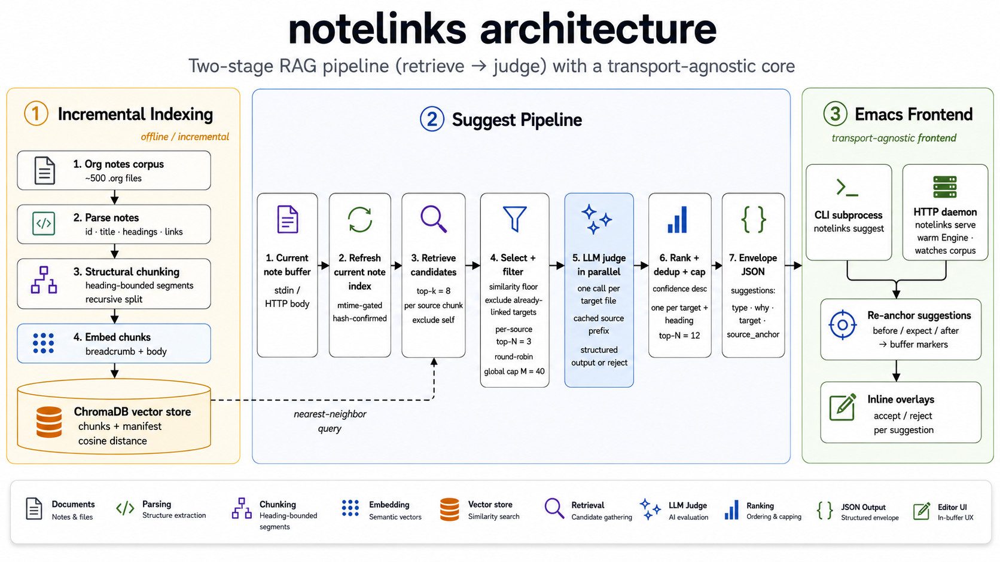

# Architecture

`notelinks` is a two-stage RAG pipeline (retrieve → judge) wrapped in a
transport-agnostic core (`Engine`), driven by an Emacs frontend over one of two
interchangeable transports. See [`design.md`](./design.md) for the authoritative
detail; this is the bird's-eye view.

## Reading the flow

1. **Indexing** — every `.org` note is parsed, split into structural chunks
   (never crossing a heading), embedded as *breadcrumb + body*, and written to a
   persistent ChromaDB store. Refresh is incremental: `mtime` gates the check,
   a content hash confirms a real change.

2. **Suggest** — the current note arrives as a buffer. Its chunks are embedded
   and used as queries; for each, the store returns the nearest neighbour
   chunks from *other* notes. Candidates are then **filtered and selected**:
   below-floor cosine scores dropped, already-linked targets excluded, and a
   per-source top-N + round-robin selection bounds cost. Surviving candidates
   are grouped by target file and sent to the **LLM judge in parallel** (one
   call per target, source note cached as the prefix); the judge classifies the
   connection, writes a rationale, and places the anchor — or rejects. Results
   are ranked, deduped, and capped into a single JSON **Envelope**.

3. **Frontend** — Emacs receives the Envelope over either transport (CLI
   subprocess or HTTP daemon), re-anchors each suggestion against the *current*
   buffer text via `before`/`expect`/`after`, drops markers, and presents
   suggestions as inline overlays the user accepts or rejects.
